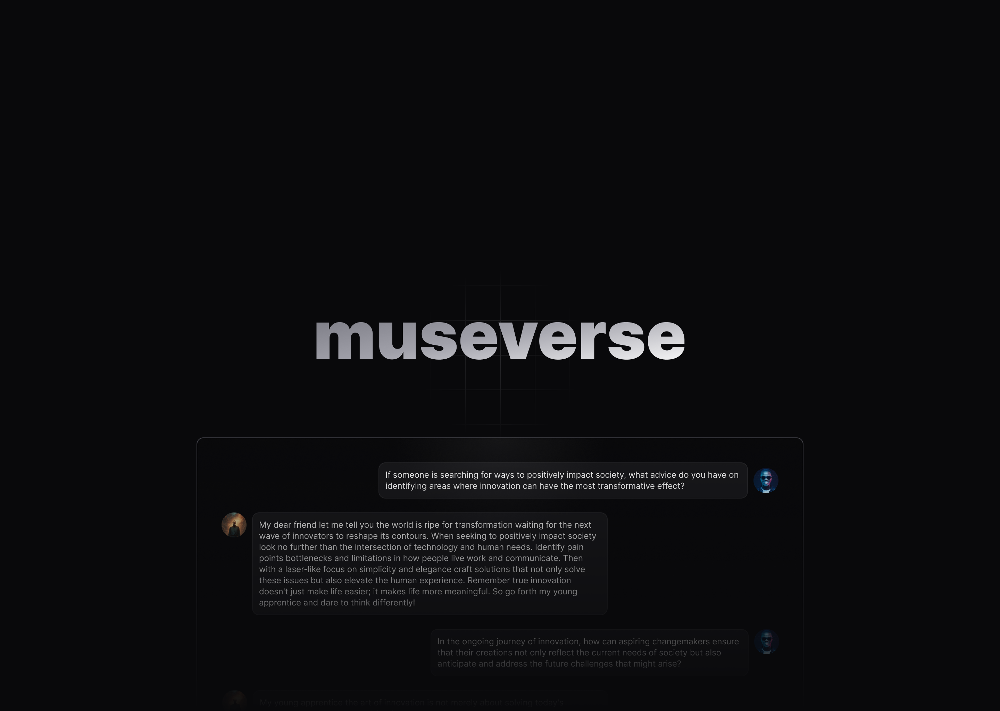

# museverse 🎶



In our contemporary world, we have tons of methods to induce unearthly productivity, but at any rate, we can’t outcompete robots.

**What makes us different is creativity.**

museverse is where you can find like-minded, knowledgeable chatbots of famous, incredibly creative people and have profound conversations with them to ignite unceasable flows of creativity.

## Getting Started

Clone repository

```bash
  git clone https://github.com/LorisYanis/museverse.git
```

Set up all the env variables outlined in the [`.env.example`](https://github.com/LorisYanis/museverse/blob/main/.env.example) file.

Install Packages

```bash
  npm install
  # OR
  pnpm install
  # OR
  yarn install
```

Run the project

```bash
  npm run dev
  # OR
  pnpm dev
  # OR
  yarn dev
```

## Tech Stack

- [Next.js](https://nextjs.org/) – Framework
- [Typescript](https://www.typescriptlang.org/) – Language
- [Tailwind](https://tailwindcss.com/) – CSS Framework
- [Clerk](https://clerk.com/) – Auth
- [Prisma](https://www.prisma.io/) - ORM
- [PlanetScale](https://planetscale.com/) – MySQL Database
- [Upstash](https://upstash.com/) – Redis
- [Pinecone](https://www.pinecone.io/) - Vector Database
- [OpenAI](https://openai.com/) - Text Generation API
- [Edge Store](https://edgestore.dev/) - Object Storage
- [Trunk](https://trunk.io/check) - Code Quality and Security Checking
